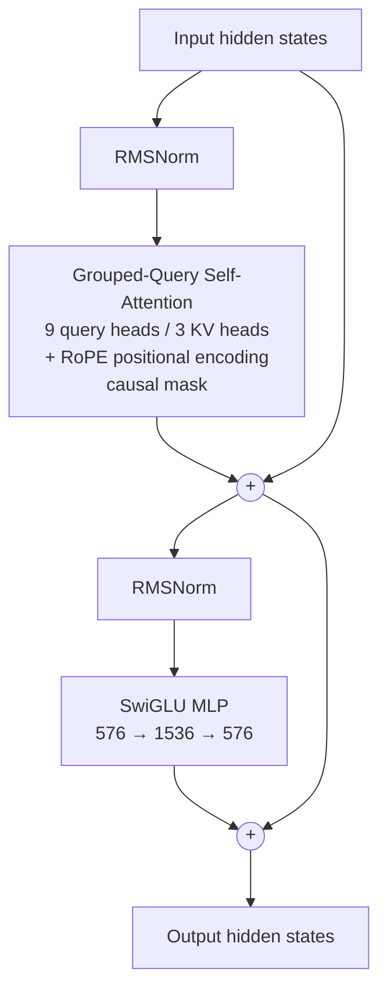

# Sukshma — A Small LLM

**Sukshma** (Sanskrit for "subtle" / "small") is a from-scratch pretraining run of a small language model, built as a single, self-contained Google Colab notebook. It trains a randomly-initialized [SmolLM2-135M](https://huggingface.co/HuggingFaceTB/SmolLM2-135M)-style architecture on streamed [FineWeb-Edu](https://huggingface.co/datasets/HuggingFaceFW/fineweb-edu) text, with checkpointing to Google Drive so training can survive Colab disconnects.

> This is a learning project — "attempted to make a small LLM from not-so-scratch." Expect rough, early-stage generations rather than a polished chat model.

## ⚠️ Current status: extremely undertrained

Let's be honest about where this is. The plan was 5000 training steps. Colab's free GPU had other plans.

**Training stopped at step 288 out of 5000 — about 5.8% of the way there** — because the free-tier GPU ran out before the model did. At this stage the model has barely skimmed the internet, let alone learned to write like it. Expect something closer to "toddler babbling in vaguely English-shaped noises" than "coherent text." If you load these weights hoping for a chatbot, you will instead get a very expensive random number generator.

This is being shared anyway because (a) the pipeline itself — architecture, streaming data loader, checkpointing, Hub upload — works end to end, and (b) more GPU time (or a Colab Pro subscription, or a kind soul with a spare A100) is the only thing standing between this and an actually-trained model.

## What's in this repo

| File | Description |
|---|---|
| `sukshma.ipynb` | The entire project: model definition, data pipeline, training loop, eval, plotting, and generation — run top to bottom in Colab. |

There is currently no separate `model.py`/`train.py`/`requirements.txt` — everything lives in the notebook.

## Model architecture

The model is a `LlamaForCausalLM` from 🤗 Transformers, initialized with **random weights** (not loaded from a pretrained checkpoint) and configured to match SmolLM2-135M:

| Param | Value |
|---|---|
| Hidden size | 576 |
| Intermediate size | 1536 |
| Layers | 30 |
| Attention heads | 9 |
| KV heads (GQA) | 3 |
| Max sequence length | 1024 |
| Tied embeddings | Yes |
| Tokenizer | `HuggingFaceTB/SmolLM2-135M` |

### Decoder-only, autoregressive

`LlamaForCausalLM` is a **decoder-only** Transformer (the same family as GPT, not an encoder-decoder like T5 or the original 2017 Transformer). There's no separate encoder — every token can only attend to itself and the tokens before it (causal/masked self-attention), and the model is trained purely to predict the next token given everything so far. That's what makes it usable for open-ended text generation straight out of pretraining.

### What's inside one decoder layer

Sukshma stacks **30 identical decoder layers**. Each one does the same two-block pattern — pre-norm attention, then pre-norm MLP — with a residual connection around each block:

Piece by piece:

| Component | What it does |
|---|---|
| **RMSNorm** (pre-norm) | A lighter, mean-free version of LayerNorm applied *before* each sub-block (not after) — standard in Llama-family models for training stability. |
| **Grouped-Query Attention (GQA)** | Self-attention where the 9 query heads share only 3 key/value heads (instead of 9 separate KV heads). Cuts the KV-cache size and compute at inference with little quality loss — this is the same GQA setup as SmolLM2. |
| **RoPE (Rotary Position Embeddings)** | Injects position information by rotating the query/key vectors as a function of token position, instead of adding learned/sinusoidal position embeddings to the input. |
| **Causal mask** | Each position can only attend to itself and earlier positions — this is what makes it a decoder ("can't see the future"). |
| **SwiGLU MLP** | The feed-forward block: expands 576 → 1536 with a gated SiLU activation, then projects back down to 576. SwiGLU (gated) tends to outperform a plain ReLU/GELU MLP at the same parameter count. |
| **Residual connections** | Each sub-block's output is *added back* to its input (the `+` nodes above), so gradients and information can skip past any individual layer — essential for training networks this deep. |

Around the 30-layer stack: a **token embedding** table at the input (576-dim per token), and a final RMSNorm before the **LM head**. Since `tie_word_embeddings=True`, the LM head reuses the same weight matrix as the input embedding instead of learning a separate one — a common trick to save parameters in small models.

## Training setup

- **Data:** `HuggingFaceFW/fineweb-edu` (`sample-10BT` config), streamed directly from the Hugging Face Hub and packed into fixed-length 1024-token blocks — no local dataset download required.
- **Optimizer:** AdamW (β = 0.9, 0.95), weight decay 0.1, cosine LR schedule with warmup.
- **Defaults:** micro-batch 4, gradient accumulation ×32 (effective batch 128), peak LR `6e-4`, 5000 steps planned, mixed precision (fp16 + `GradScaler`, tuned for a T4 GPU).
- **Checkpointing:** saves to `/content/drive/MyDrive/smol_llm/checkpoints` every 30 minutes (or every 200 steps, whichever comes first), keeping the last 3 checkpoints. Re-running the notebook automatically resumes from the latest checkpoint.
- **Eval:** a small fixed held-out set of batches (never trained on) is used to track eval loss/perplexity alongside training loss.

## How to run it

1. Open the notebook in Colab:
   
2. Select a GPU runtime (Runtime → Change runtime type → T4/A100).
3. Run the first cells to install dependencies and mount your own Google Drive — checkpoints and the final model will be saved there under `smol_llm/`.
4. Run the remaining cells in order: model init → resume from checkpoint (grab the one below if you want to continue from step 288 instead of starting over) → build the streaming dataset → train → plot loss/perplexity → generate a sample → export the final model.
5. If you have more GPU time than we did: just keep it running past step 288 and let it reach 5000+. That's really the whole fix here.

## Training curves

Loss and perplexity over the 288 steps it got to run:

(Generated by the plotting cell in the notebook, reading loss_log.csv.)

*(Generated by the plotting cell in the notebook, reading `loss_log.csv`. Save your plot image into the repo as `loss_curve.png` — same folder as this README — for it to show up here.)*

## Weights & checkpoints

- 🤗 **[sukshma-135m on the Hugging Face Hub](https://huggingface.co/mohitkumawattt/sukshma-135m)** — the step-288 checkpoint exported to standard 🤗 format. Loadable with `AutoModelForCausalLM.from_pretrained("mohitkumawattt/sukshma-135m")`, but see the status warning above before you get excited.
- 📦 **[Raw checkpoints + training logs (Google Drive)](https://drive.google.com/drive/folders/1veKARZfGG5IwvllcQcDEd0odEQvmfpKv?usp=sharing)** — includes `step_000288.pt` and `loss_log.csv`, if you want to resume training yourself instead of starting from scratch.

## Notes / caveats

- Step 288/5000 is not enough tokens for coherent, general-purpose generations by a wide margin. Treat this repo as a working pipeline to pick up and continue, not a finished model.
- On an A100 you can likely switch from fp16/GradScaler to bf16 and drop the scaler for simpler, faster training (noted as a TODO in the notebook) — also just generally faster than whatever free-tier GPU ran out on us.
- Contributions of spare compute are, unsurprisingly, extremely welcome.

## License

No license file is currently included. Please add a license (e.g., [MIT](https://choosealicense.com/licenses/mit/) or [Apache-2.0](https://choosealicense.com/licenses/apache-2.0/)) to the repository if you want others to reuse this code.
